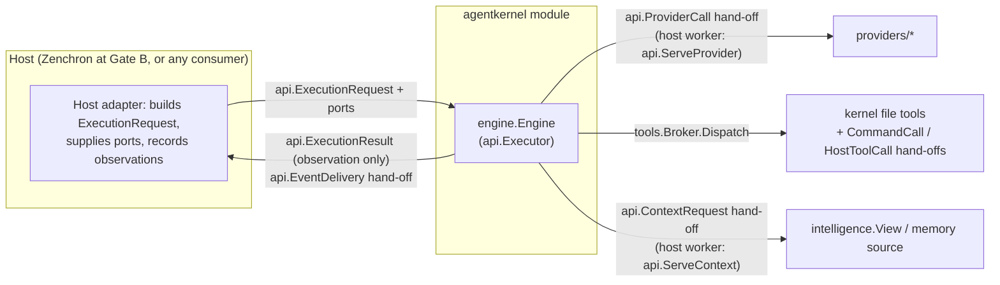
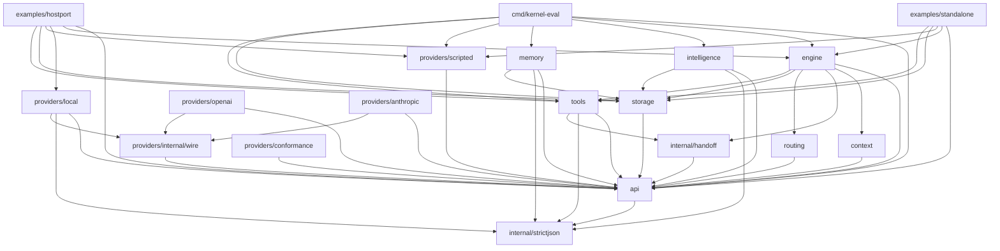
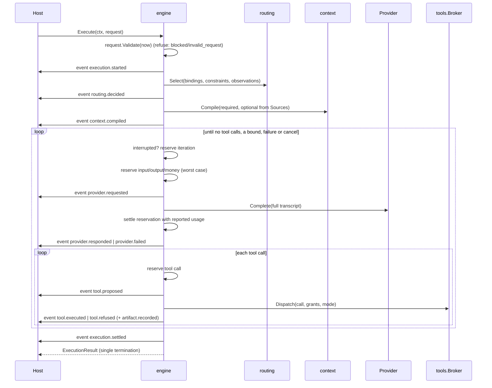

# Agent Execution Kernel — architecture

Status: Gate A (isolated module). Normative detail lives in `docs/spec/*`; this
document maps responsibilities and dependencies. Where it names a type or
function, the code is authoritative.

## 1. Boundary

Arrows are calls or hand-offs, not imports. The kernel imports nothing outside
this module and the standard library. Every port a host can implement
(events, context sources, providers, commands, host tools) is a channel of
`api.Call`s served by host-owned workers and waited on within a bound by
`internal/handoff.Exchange`, which starts no goroutine; what the kernel calls
directly is kernel-owned (`storage` stores, `api` clocks, `tools` built-ins).
Execution spec §4.1 lists every host callback and its bound.

## 2. Responsibility map

| Concern | Owner (package / type) | Not owned here |
| --- | --- | --- |
| Contract, versions, strict decoding, validation | `api`: `ExecutionRequest.Validate`, `DecodeRequest`, `ExecutionVersion`; the one strict JSON decoder in `internal/strictjson` | host admission, policy |
| One bounded execution, settlement | `engine`: `Engine.Execute`, `run.finish` | durable attempts, retries across attempts |
| Resource accounting | `engine`: `ledger` (atomic multi-dimension reservations), `account` | run/plan budgets, global capacity |
| Cancellation provenance | `api.CancellationOf`, `api.Cancellation` | the host's termination owners |
| Context selection | `context.Compile`, `ContextManifest` | which context the host must supply |
| Provider choice | `routing.Select` over host bindings | eligibility, pins, isolation proof |
| Provider wire + usage normalization | `providers/openai`, `providers/anthropic`, `providers/local`; shared HTTP mechanics in `providers/internal/wire` | credentials (host `api.CredentialSource`), endpoints |
| Tool admission | `tools.Broker` (`admit`, `Specs`, `Dispatch`, `bound`) | granting capability |
| File tools | `tools.Workspace` (`ReadFile`, `Search`, `WriteFile`, `ApplyPatch`, `ReadFiles`) | protected isolation |
| Host port hand-off | `internal/handoff.Exchange` (kernel side), `api.Serve*` / `tools.ServeTool` (host workers) | the workers, their lifetime |
| Commands | `tools.NewCommand` over a host `api.CommandCall` channel | spawning, containment, reaping |
| Admission across processes | `engine` `run.admit` over `storage.Records.PutIfAbsent` claims | recovering a crashed attempt's claim |
| Artifact and record persistence | `storage`: `MemoryArtifacts`, `FileArtifacts`, `MemoryRecords`, `FileRecords` | the host journal / `runtime.db` |
| Derived memory | `memory.Store`, `memory.Store.Source` | engineering facts, authority |
| Repository structure | `intelligence`: `Build`, `Open`, `Index.Overlay`, `NewView` | ProjectModel, impact, ownership (#67) |
| Ranking data for learning | `routing.Report` (offline) | learned routing (#70) |
| Offline benchmark harness | `cmd/kernel-eval` over `testdata/eval` (method: `docs/benchmarks/methodology.md`) | paid-model quality, accepted-change throughput (#66) |

## 3. Package dependency graph

Generated from the real import graph on 2026-10-07 with
`GOWORK=off go list -f '{{.ImportPath}} {{join .Imports " "}}' ./...`
(module-internal edges only; every other import is standard library). Test-only
packages under `tests/` are not production nodes. `tests/architecture`
(`TestPackageDependencyMap`) fails on any module-internal edge outside its
reviewed allow-map and prints the actual graph (edge list and Mermaid) under
`go test -v`; regenerate this diagram from that output or the command above.

Facts the graph makes visible:

- `api` imports nothing from the module; it is the only shared vocabulary.
- `engine` does not import `memory`, `intelligence` or any provider. It
  reaches them only through hand-off channels a host serves
  (`api.ServeContext`, `api.ServeProvider`), so a host composes them. It
  imports `storage` for the kernel-owned artifact and admission stores.
- Adapters share HTTP mechanics through `providers/internal/wire`, which is
  unimportable outside `providers/`.
- `providers/conformance` imports `testing`; it is a test library imported only
  by adapter tests.
- `cmd/kernel-eval` is the only package that composes `engine` with
  `intelligence` and `memory`, as context sources; it is a development
  harness, not a production entry point.
- `tests/architecture` and `tests/conformance` contain only `_test.go` files
  (they have no production imports); `tests/conformance` exercises `api`,
  `engine`, `intelligence`, `memory`, `providers/scripted`, `storage` and
  `tools` from its tests. Neither is a node above.

## 4. One execution

## 5. State and persistence

The engine keeps no state across executions. Per execution it holds a `run`
(transcript, ledger, account, observations); it is discarded when `Execute`
returns. Durable state exists only where a host supplies it: the event sink
behind its worker, a `*storage.FileArtifacts`, the admission
`storage.FileRecords` (claims and consumption per `execution_id`), and
`storage.Records` under `memory.Store` or the `intelligence` cache. Storage roots are always explicit absolute paths; nothing
assumes the parent checkout.

## 6. Trust classes

Only request `ContextItem`s with `Trust: host` and kind `instruction` or
`constraint` become system text (`engine.systemItem`); the kernel's own
`boundaryText` is the other system text. Everything else — host task text,
workspace content, tool output, intelligence items (`TrustWorkspace`), memory
items (`TrustMemory`) — is rendered as a delimited data block whose markers
carry the content digest (`engine.renderUser`). Items from a `ContextSource`
claiming `host` trust are demoted to `memory` (`run.sourceItems`).

## 7. What Gate A does not contain

No scheduler, run store, durable queue, plan, candidate, policy or authority
type. No subprocess spawning. No network endpoint configured by repository
content. No learned routing. No import of, or dependency on, any other package
of `github.com/bogdaniel/zenchron-engineering`.
